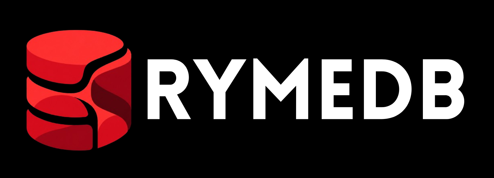

rymeDB is an open-source, ultra-low-latency distributed relational database and
backend platform. One static `ryme-server` binary serves PostgreSQL wire
protocol clients, RESP (Valkey-compatible) clients, and a REST operator API.

## Quick start

```bash
cargo run -p ryme-server --release
```

Default listeners:

* Postgres wire: `127.0.0.1:5433`
* RESP: `127.0.0.1:6380`
* REST: `127.0.0.1:8080`

Set `RYME_API_KEY` for auth. See `docs/configuration.md` for all options.

```bash
psql -h 127.0.0.1 -p 5433 -U postgres -c "SELECT 1"
curl -H "Authorization: Bearer $RYME_API_KEY" http://127.0.0.1:8080/v1/health
```

SDKs live in `sdks/` (Python, JS, Go, Rust, Swift, Kotlin, Dart, C#).
CLI lives in `apps/cli`. Dashboard is served at `GET /dashboard`.

## Docs

* `docs/configuration.md`
* `docs/cluster-operations.md`
* `docs/backup-restore.md`
* `docs/production.md`
* `docs/performance.md`
* `docs/isolation.md`
* `docs/resp.md`
* `docs/streaming.md`
* `docs/migration.md`

REST reference: `schemas/openapi/rest.yaml`

## Changelog

See [CHANGELOG.md](CHANGELOG.md).

## License

Apache-2.0. See [LICENSE](LICENSE).

## Maintainers

See [MAINTAINERS.md](MAINTAINERS.md). Security reports: see [SECURITY.md](SECURITY.md).
